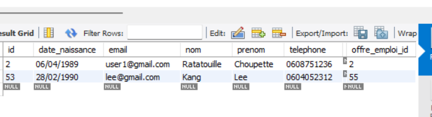
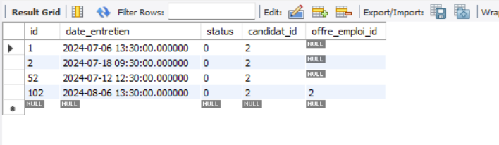

# Application de Gestion de Recrutement

Cette application de gestion de recrutement permet de suivre et 
de gérer les processus de recrutement au sein d'une entreprise. 
Elle offre des fonctionnalités pour créer, suivre et gérer les 
candidats, les offres d'emploi, les entretiens.

###
***
#### Fonctionnalités

1. Gestion des candidats

- Ajouter, modifier, supprimer et afficher les candidats.
- Accéder à la fiche candidat (afficher son détail)
- Associer un candidat à une offre d'emploi 
- Programmer un entretien pour un candidat

2. Gestion des offres d'emploi

-  Créer, modifier, supprimer et consulter les offres d'emploi.
- Associé une offre d'emploi à un entretien

3. Gestion des entretiens

- Ajouter, modifier, supprimer et afficher les entretiens.
- Planifier et suivre les entretiens des candidats.

### Prérequis

Avant de lancer l'application, assurez-vous d'avoir installé les éléments suivants 

- Java 8 ou plus
- Maven
- N'oubliez pas de créer votre application avec spring 
    -> [le lien ici](https://start.spring.io/)
- Installez les dépendances (MS SQL Server Driver SQL, Spring Web, Thymeleaf,
  Spring Web Services, Spring Boot DevTools )

#### 

#### Installation et configuration de l'application

- Clonez ce dépôt sur votre machine locale.
- Ouvrez le fichier application.properties et mettez à jour les 
- paramètres de connexion à votre base de données.
- N'oubliez pas de créer votre base de donnée

## Fonctionnalité de l'application

#### Crud candidat

On peut recevoir les coordonnées du candidat lié a une offre d'emploi

Modifier un candidat

Supprimer un candidat 

Afficher le détail 

#### Crud offre emploi

On peut afficher la liste des offres d'emploi

on peut modifier une offre d'emploi

On peut supprimer une offre d'emploi

#### Crud entretien

liste entretien associé a un candidat et une offre d'emploi

